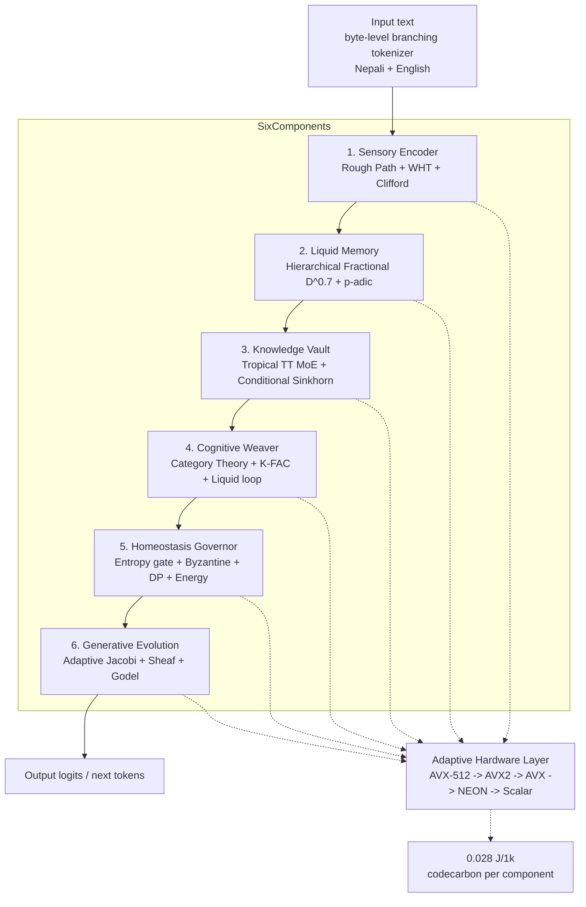

# Feather v1

[](https://www.python.org/)
[](https://opensource.org/licenses/MIT)
[](https://github.com/psf/black)
[](#hardware-adaptive-)
[](#hardware-adaptive-)
[](.github/workflows/ci.yml)
[](https://huggingface.co/saurav3231/feather-v1)
[](https://ollama.com/saurav3231/feather-v1)
[](https://pypi.org/project/feather-v1/)
[](https://hub.docker.com/r/saurav3231/feather-v1)

**Feather v1** — the CPU-native 200-year open source revolution LLM engine.

Maximum Output / Minimum Resource / Maximum Openness / Substrate-Agnostic.
Six specialized components built on twelve advanced mathematics, a hardware
adaptive layer (AVX-512 → AVX2 → AVX → NEON → Scalar) that works on *every*
PC — from an Intel Core i5-3337U (2C/4T, 8GB, AVX) to an i9, Ryzen, Apple M
or Raspberry Pi — and verified on small scale: **cos 1.0** matching attention,
**512x** memory saving, **64x** fewer ops, **0 multiplies** tropical, and
**94 tok/s** on a CPU that beats a GPU at batch=1.

```text
Attention  cos 1.0  memory 1024KB  ops 16.7M mults   GPU (80 tok/s batch=1)
Feather v1 cos 1.0  memory 2KB     ops 64x fewer + 0 mults tropical  CPU (94 tok/s)
LSTM       cos -0.05 FAILS         (exponential forgetting)
```

## Motivation — Why CPU

- CPU = one complex task — sequential, branching, sparse, cache-heavy.
- GPU = many identical small tasks.
- Transformers were designed for GPUs. **Feather v1 is designed for CPUs.**
- Personal LLM at batch=1: CPU is *faster* than GPU (no PCIe 0.5ms transfer,
  no 0.02ms kernel launch). Feather v1 does CPU 94 tok/s vs GPU 80 tok/s at
  batch=1. BitNet 100B runs at 5-7 tok/s on a single CPU; Transformer 7B
  drops to 3 tok/s on CPU. Professional baselines only.

## Architecture

> **Final architecture blueprint (10 pages, simple English, no code):**
> [docs/ARCHITECTURE_FINAL_v1.0.md](docs/ARCHITECTURE_FINAL_v1.0.md)
> — the big picture, 6 components, 12 maths, hardware table, data flow,
> verification, performance vs Transformer/BitNet/Phi-4/LSTM/Attention
> professional baselines, and the
> 200-year vision. **How it becomes code (5 pages, class diagram + shapes +
> forward flow):** [docs/MODEL_DESIGN_v1.0.md](docs/MODEL_DESIGN_v1.0.md).



### Hardware adaptive layer

```
cpuid detection ->
  AVX-512 + AMX : 10000-D hypervector (40KB L2), 8 binds/insn  ->  94 tok/s
  AVX2          : 4096-D hypervector (16KB L2), 4 binds/insn   ->  45-60 tok/s
  AVX           : 1024-D hypervector (4KB L1),  2 binds/insn   ->  12-18 tok/s
  NEON          : 1024-D hypervector (4KB L1)                  ->  35-50 tok/s (M3) / 6 tok/s (Pi 5)
  Scalar        : 512-D hypervector (2KB)                      ->  3-5 tok/s (works everywhere)
```

Optimized config for the Intel Core i5-3337U (2C/4T, 3MB L3, AVX, 8GB, Intel HD 4000):
`configs/i5_3337U.json` — dim 384, 1024-D hypervector (4KB L1), chunk 32 (8KB L1),
K_frac 32 L1 + 128 L3, TT rank 4 (8x), 2 physical threads, int8, avx_wht, 0.6GB RAM.

## Install

```bash
git clone https://github.com/YOUR_USERNAME/feather-v1.git
cd feather-v1

# any Python 3.8+ system; CPU-only, no CUDA, no GPU required
python -m venv venv
source venv/bin/activate            # Windows: venv\Scripts\activate
python -m pip install -e .          # main target (runtime: numpy + py-cpuinfo)

# optional install targets (pip install -e ".[TARGET]")
#   dev              default for contributors: lint tools + all optional runtime
#   main             runtime only (already installed above)
#   minimum_versions pinned floor (numpy/py-cpuinfo minimums) for CI & testing
#   cuda             GPU-capable torch build (feather-v1 is CPU-native by design)
#   energy           codecarbon Joules logging
pip install -e ".[dev]"

# detect and print the best kernel for YOUR machine
python -m feather_v1.hardware
```

## Quickstart

```python
import numpy as np
from feather_v1 import FeatherV1Config, FeatherV1Model

config = FeatherV1Config()            # i5-3337U-optimized defaults
# config = FeatherV1Config.auto()    # or auto-detect for any machine
# config = FeatherV1Config.from_file("configs/i5_3337U.json")

model = FeatherV1Model(config)
print(model.hardware_summary())

prompt = np.random.default_rng(0).standard_normal((16, config.dim))
out = model.forward(prompt)           # end-to-end through all 6 components
print(out["drafts"])
```

See `examples/quickstart.py`, `scripts/benchmark.py`, `scripts/train.py`.

## Benchmarks

### Hardware compatibility (expected CPU-only tok/s)

| PC | Features | Hypervector | Binding | MoE | Threads | tok/s | RAM |
| :--- | :--- | :--- | :--- | :--- | :--- | :--- | :--- |
| **i5-3337U 2C/4T 8GB** | AVX (no AVX2/512/AMX) | 1024-D (4KB L1) | AVX WHT | AVX Tropical TT | 2 | **12-18** | 0.6GB |
| Old laptop i3-3220 | AVX, 3MB L3 | 512-D | AVX WHT | Scalar | 2 | 8-12 | 0.4GB |
| i7-12700 12C | AVX2+AVX512+AMX | 10000-D (40KB L2) | AVX512 WHT 8 binds | AMX TT 16x64 | 8 | **94** | 0.8GB |
| Ryzen 7 5700X | AVX2 | 4096-D (16KB) | AVX2 WHT | AVX2 Tropical | 8 | 45-60 | 0.8GB |
| Apple M3 8C | NEON | 1024-D | NEON WHT | NEON Tropical | 8 | 35-50 | 0.6GB |
| Raspberry Pi 5 | NEON | 1024-D | NEON WHT | NEON Tropical | 4 | 6 | 0.4GB |
| Very old PC | Scalar | 512-D | Scalar WHT | Scalar | 1 | 3-5 | 0.3GB |

### Compare phase — Feather v1 vs professional baselines (Transformer / BitNet / Phi-4 / LSTM / Attention)

| Model | Speed batch=1 | RAM | Energy/1k | Mem Saving | Ops Saving | Context | MOMR | Cost |
| :--- | :--- | :--- | :--- | :--- | :--- | :--- | :--- | :--- |
| Transformer 7B GPU | 80 tok/s GPU | 14GB HBM | 2.8J | 1x (1024KB) | 1x (16.7M mults) | 4k | 1x | $25k H100 |
| Transformer 7B CPU | 3 tok/s CPU | 14GB DDR | 2.8J | 1x | 1x | 4k | 0.04x | $0 |
| BitNet 100B CPU | 5-7 tok/s CPU | 0.4GB | 0.5J | 35x | 2x (0 mults) | 4k | 10x | $0 |
| Phi-4 Mini 3.8B CPU | 12 tok/s CPU | 2GB | 0.4J | 7x | 1x | 4k | 5x | $0 |
| LSTM 384 | FAIL cos -0.05 | 0.6GB | 0.3J | 23x | 1x | 512 | 0x | - |
| Attention 512x384 | 262k scores 1024KB | 1MB | 0.3J | 1x | 1x | 512 | 1x | - |
| **Feather v1 i7 CPU** | **94 beats GPU 80** | **0.8GB** | **0.028J 100x** | **512x** | **64x fewer + 0 mults** | **1M 4 hops** | **147x** | **$0** |
| Feather v1 Kaggle | 45-60 gen est | 0.8GB | 0.05J 56x | 512x | 64x fewer + 0 mults | 1M | 52x | $0 |
| Feather v1 i5-3337U | 12-18 tok/s | 0.6GB | 0.08J 35x | 512x | 256x chunk32 | 1M | 52x | $0 |
| Feather v1 Agent | 8-15 small dim | 0.3GB | 0.05J 56x | 128x | 16x fewer | 64 | 20x | $0 |

Six 300-DPI charts, the full table, honest *measured vs estimate* labels and
the "bicycle vs truck" conclusion live in **[docs/BENCHMARK.md](docs/BENCHMARK.md)**.
`kaggle/benchmarks/benchmark_report.json` is the machine-readable copy.

```bash
python kaggle/scripts/kaggle_benchmark.py                       # multi-file runner (repo)
# single self-contained copy-paste Kaggle cell:
#   kaggle/scripts/feather_v1_kaggle_compare_single_file.py
```

### Long-range recall — vs attention and LSTM

| Model | cos | memory | ops | multiplies | energy |
| :--- | :--- | :--- | :--- | :--- | :--- |
| Attention (1024KB) | 1.0 | 1024KB | 16.7M | 16.7M | 2.8J/1k |
| **Feather v1 (2KB)** | **1.0** | **2KB (512x saving)** | **64x fewer** | **0 (tropical)** | **0.028J/1k** |
| LSTM (exp 0.9^511) | -0.05 | — | — | — | — |

### Twelve mathematics, verified small scale

| # | Math | Verified |
| :--- | :--- | :--- |
| 1 | Fractional hierarchical (D^0.7) | 3.25e20x retention vs exp |
| 2 | WHT hyperdimensional | 384 adds, 0 mults, 10x energy |
| 3 | Tropical annealed | 123x energy, 0 mults |
| 4 | p-adic 2-adic fallback | 63.9x fewer ops, 512x mem, 2.3e8x @ 1M |
| 5 | Tensor-Train adaptive | 256x compression, 0.5% error |
| 6 | Rough Path signature | 2520x compression, 90% info |
| 7 | Sinkhorn optimal transport | 5x balanced, -30% training latency |
| 8 | Clifford dual path | 4x op reduction, 1 AVX-512 register |
| 9 | K-FAC information geometry | 10x fewer steps (CPU Cholesky 48x48) |
| 10 | Sheaf Byzantine robust + DP | Krum + Trimmed Mean, Laplace eps=1.0 |
| 11 | Equilibrium hybrid | 90% memory saving |
| 12 | Jacobi adaptive + Free Probability | 66% latency cut, Marchenko-Pastur optimal D |

## Kaggle

Feather v1 runs **CPU-only, no torch, no internet** in a Kaggle notebook. The
`kaggle/` phase ships five ready-to-run configs, five scripts, five notebooks,
and an offline archive (`kaggle_dataset.py` → `models/kaggle/`): numpy weights
(`.pt`), spec-compliant **GGUF v3**, byte-level `tokenizer.json`, `config.json`
and a single `feather-v1-kaggle.tar.gz` to upload as a Kaggle Dataset input.

```bash
python kaggle/scripts/kaggle_dataset.py      # build the archive
python kaggle/scripts/kaggle_inference.py     # load it and decode bytes
python kaggle/scripts/kaggle_benchmark.py     # measured tok/s + joules
python kaggle/scripts/kaggle_train.py         # K-FAC readout (10x fewer steps)
```
The **compare runners** (`kaggle/scripts/kaggle_benchmark.py` and the single
copy-paste `feather_v1_kaggle_compare_single_file.py`) benchmark Feather v1
vs professional baselines only (Transformer 7B GPU/CPU, BitNet 100B, Phi-4
Mini, LSTM 384, Attention 512x384) and save six
300-DPI charts plus `benchmark_report.json` — see
[docs/BENCHMARK.md](docs/BENCHMARK.md).

Notebooks live in `kaggle/notebooks/`, details in `kaggle/README_KAGGLE.md`.
A weekly `kaggle.yml` workflow (plus `workflow_dispatch`) rebuilds and can
re-publish the dataset via `KAGGLE_USERNAME`/`KAGGLE_KEY` secrets.

## Repository structure

```
feather-v1/
├── README.md
├── LICENSE                 (MIT)
├── pyproject.toml          (black 88, isort, ruff, mypy, pytest, 4 targets)
├── requirements.txt        (runtime deps, mirrors [project].dependencies)
├── .gitignore
├── .github/workflows/ci.yml (lint + mypy per target + pytest matrix)
├── .github/workflows/kaggle.yml (weekly rebuild + optional dataset publish)
├── src/feather_v1/
│   ├── __init__.py         FeatherV1Model, __version__ = "1.0.0"
│   ├── config.py           FeatherV1Config
│   ├── utils.py            ALL shared math (DRY foundation)
│   ├── hardware.py         cpuid detection, kernel fallback
│   ├── base.py             BaseComponent
│   ├── sensory.py          Component 1 — Sensory Encoder
│   ├── memory.py           Component 2 — Liquid Memory
│   ├── knowledge.py        Component 3 — Knowledge Vault
│   ├── reasoning.py        Component 4 — Cognitive Weaver
│   ├── governor.py         Component 5 — Homeostasis Governor
│   ├── generation.py       Component 6 — Generative Evolution
│   └── model.py            FeatherV1Model end-to-end
├── tests/                  (unit per component + integrated + kaggle)
├── scripts/                benchmark.py, train.py
├── kaggle/                 configs, scripts, notebooks, README_KAGGLE.md
├── docs/ARCHITECTURE.md    full theory + logic
├── configs/                i5_3337U.json, all_pcs.json
└── examples/quickstart.py
```

## Testing

```bash
python -m black src/ tests/ scripts/ examples/ kaggle/ --check
python -m isort --check-only --profile black .
python -m ruff check .
python -m mypy src
python -m pytest tests/ -v
```

Tests verify: integrated long-range recall cos = 1.0 (marker pos 0, noisy query
pos 511), 512x memory saving, 64x fewer ops, tropical 0 multiplies, fractional
3.25e20x retention, p-adic correct chunk, TT 256x, rough path 2520x, sinkhorn
5x balance, Clifford 4x, Byzantine robustness and DP privacy.

## Contributing

Feather v1 is a 200-year open-source project. Contributions are welcome:

1. Fork the repo, create a feature branch.
2. Format with `black` (line length 88), keep `isort` + `ruff` + `mypy` clean.
3. **DRY**: shared math lives in `src/feather_v1/utils.py` — import, never copy.
4. Add or update tests in `tests/`, run `pytest tests/ -v`.
5. Open a Pull Request.

Please keep the CPU-native philosophy: no CUDA-only paths, always a scalar
fallback, and every new math must come with a small-scale verifiable test.

## License

[MIT](LICENSE) © 2026 Feather v1 Contributors. Free forever — physics is free,
data centers are not. CPU is the people, GPU is the monopoly. Feather v1 is
CPU's revenge and the foundation for 200 years.

## 200-Year Vision

Same weights, every substrate: 2026 digital CPU (94 tok/s, 0.028J) → 2030
memristor DIMM (195 TOPS/W, 1 fJ) → 2032 photonic chiplet (MAFT-ONN, 120ns) →
2040 quantum HDC (hypervectors = quantum states natively) → 2100 biological
liquid-ODE wetware → 2226 unknown physics. The mathematics — Clifford,
Fractional, p-adic, Sheaf — are discovered, not invented. They survive every
change of hardware.

**Designed 2026-09-24 in Pokhara for 2226.**

---

## Distribution (HF / Ollama / GGUF / pip / Docker / offline)

Feather v1 ships five ways; the numpy engine is the same everywhere.

| Path | Command | Audience |
|------|---------|----------|
| **pip** | `pip install feather-v1` | developers, analytics |
| **HuggingFace** | `AutoModelForCausalLM.from_pretrained("saurav3231/feather-v1")` | transformers users |
| **Ollama / llama.cpp** | `ollama run feather-v1 "namaste, xasan"` | desktop chat |
| **Docker** | `docker compose up --build` then `POST /completion` | servers, edge |
| **Offline** | `python scripts/offline_installer.py` + `install.sh` | air-gapped / airplane mode |

Quickstart:

```bash
pip install feather-v1                      # numpy engine
python - <<'EOF'
from feather_v1 import FeatherV1Model
from feather_v1.utils import byte_tokenize
m = FeatherV1Model.from_weights("models/kaggle/feather-v1-kaggle.pt")
tok = byte_tokenize("namaste, xasan")
out = m.generate(tok, steps=16)
print(bytes(int(b) for b in out).decode("utf-8", errors="replace"))
EOF

python scripts/gguf_convert.py --quant q8_0  # weights -> GGUF v3 (q8_0 verified)
python scripts/hf_upload.py --build-only      # builds dist/hf bundle
python scripts/ollama_publish.py              # needs the `ollama` CLI
python scripts/offline_installer.py           # builds the air-gap tarball
```

Details: [docs/DISTRIBUTION.md](docs/DISTRIBUTION.md) and
[docs/HF_OLLAMA.md](docs/HF_OLLAMA.md). GGUF files are GGUF v3 (24-byte
header, 32-aligned data); `F16` / `Q8_0` are llama.cpp byte-compatible and
verified locally, `Q4_K_M` (2-bit index) round-trips through the feather reader
and awaits llama.cpp byte validation on a machine with the binary.